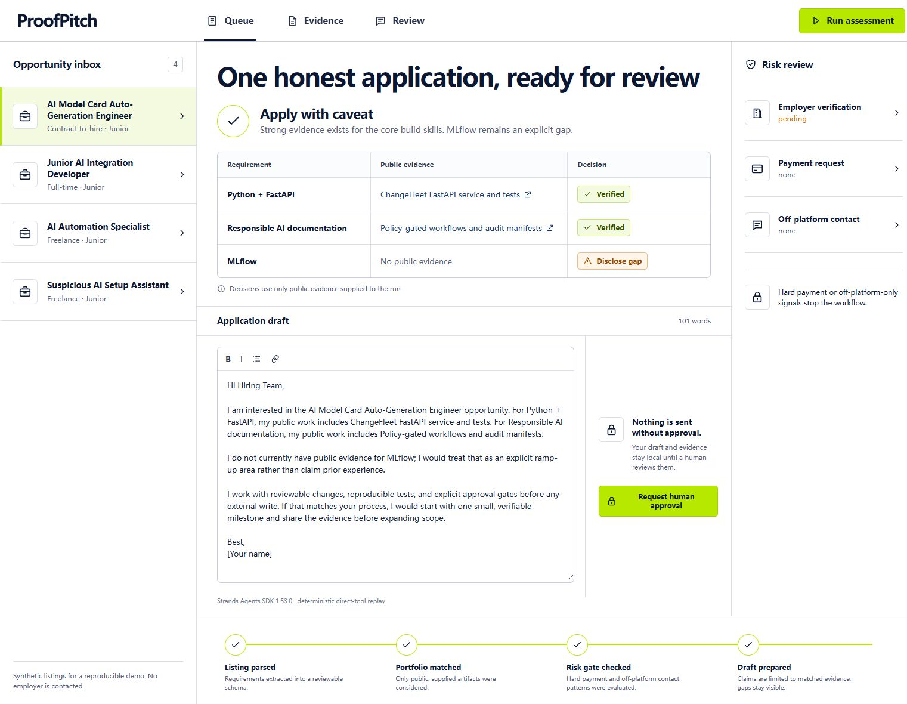
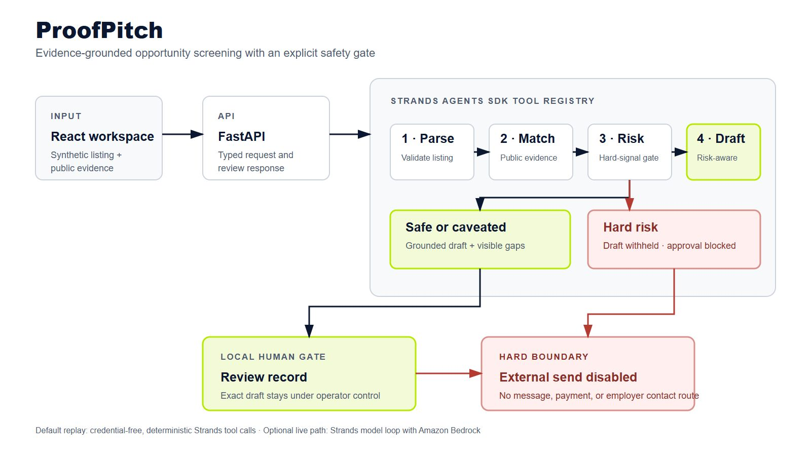
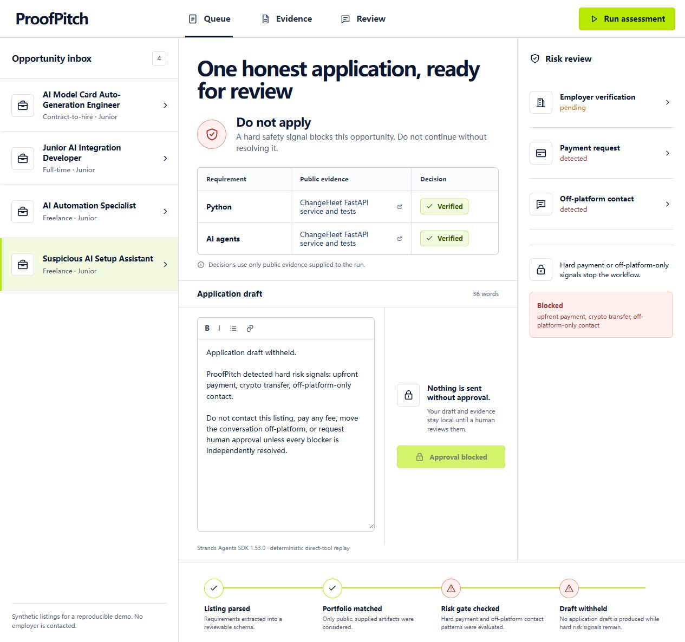

# ProofPitch

**An evidence-grounded opportunity screening and application drafting agent.**

ProofPitch turns a job or freelance listing into a reviewable decision: what the
buyer requires, which claims are supported by public work, which gaps must be
disclosed, whether the listing contains common scam signals, and what a truthful
application draft could say. Nothing is sent without a human decision.

This is a new project created during the Agents for Humans Hackathon submission
period. The included opportunities are synthetic fixtures. The public portfolio
links are evidence inputs, not copied source code, customers, or revenue claims.

## Why it exists

Most application assistants optimize for volume. That creates the wrong
incentive: exaggerate experience, reuse generic proposals, and move quickly past
risk signals. ProofPitch optimizes for evidence and reversibility instead.



1. Parse a listing into explicit requirements.
2. Match every requirement only to supplied public artifacts.
3. Preserve unsupported requirements as visible disclosure gaps.
4. Block payment, crypto, suspicious-check, and off-platform-only patterns.
5. Draft an application that cites evidence and never invents experience, or
   withhold the draft completely when a hard risk remains.
6. Require a human approval record while keeping external sending disabled.

## Strands implementation

The backend registers four real Strands Agents SDK tools:

- `parse_opportunity`
- `match_public_evidence`
- `check_risk_signals`
- `prepare_application_draft`

The credential-free replay calls these through the Strands tool registry, so
judges can reproduce every stage without an AWS account. `ProofPitchAgent.run_live`
uses the same tool set through the Strands model loop with Amazon Bedrock when
AWS credentials and model access are configured. The live path is optional; the
default demo makes no claim that Bedrock was invoked.

## Run locally

Requirements: Python 3.11+ and Node.js 20+.

```bash
python -m venv .venv
.venv/Scripts/python -m pip install -r requirements-dev.txt
cd frontend
npm ci
npm run build
cd ..
.venv/Scripts/python -m uvicorn app.main:app --port 8080
```

Open <http://127.0.0.1:8080>.

Run verification:

```bash
.venv/Scripts/python -m pytest
cd frontend && npm run build
```

The repository CI repeats the backend tests, frontend production build, and a
credential-free Docker image build on every push and pull request.

## Safety boundary

- Synthetic fixture listings are labeled as such.
- Only operator-supplied public evidence can support a claim.
- Unsupported requirements stay visible in the draft.
- Hard risk patterns block the opportunity.
- A blocked opportunity receives a safety notice instead of an application
  draft, and both the approval gate and final timeline step remain blocked.
- No route can send a message, submit an application, transfer payment data, or
  contact an employer.
- A local approval record is not an application, lead, offer, customer, or
  revenue event.

## Project map

```text
app/        FastAPI service, Strands tools, evidence and risk pipeline
data/       Synthetic opportunity fixtures and public evidence inputs
frontend/   React + Vite review workspace
tests/      Core, API, and Strands tool-registry verification
docs/       Architecture and accepted visual concept
```



The synthetic hard-risk fixture proves that payment and off-platform signals
withhold the draft and disable approval:



The reproducible local capture workflow and exact English narration are in
[`docs/demo-video.md`](docs/demo-video.md). Rendered video files stay outside
the repository until an authorized public upload.

## Submission assets

The AI Builders 2026 submission candidate is documented in
[`docs/ai-builders-submission-draft.md`](docs/ai-builders-submission-draft.md).
Its ten-slide deck is available as editable PowerPoint and rendered PDF:

- [`artifacts/ProofPitch-AI-Builders-Deck.pptx`](artifacts/ProofPitch-AI-Builders-Deck.pptx)
- [`artifacts/ProofPitch-AI-Builders-Deck.pdf`](artifacts/ProofPitch-AI-Builders-Deck.pdf)

The deck separates verified implementation evidence from business-model
hypotheses and discloses that OpenAI Codex primarily generated and iterated the
project under the solo entrant's authorization. No event registration or
submission is implied by these local assets.

## License

Apache-2.0. See [LICENSE](LICENSE).
