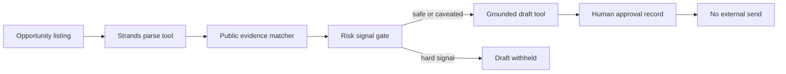

# Architecture

ProofPitch uses four registered Strands tools. The public replay invokes them
directly through the Strands agent tool registry so the workflow is reproducible
without credentials or paid inference. A separate `run_live` path invokes the
same tools through the Strands model loop with Amazon Bedrock when the operator
has configured lawful AWS access.

The API never exposes an outbound-send route. Even the approval endpoint records
only a local review result and always returns `external_send: false`.

The draft tool receives the completed risk review as an explicit input. It
returns a safety notice instead of an application whenever the review contains
a blocker, so the risk decision cannot be bypassed by calling the next tool in
the registered sequence.
